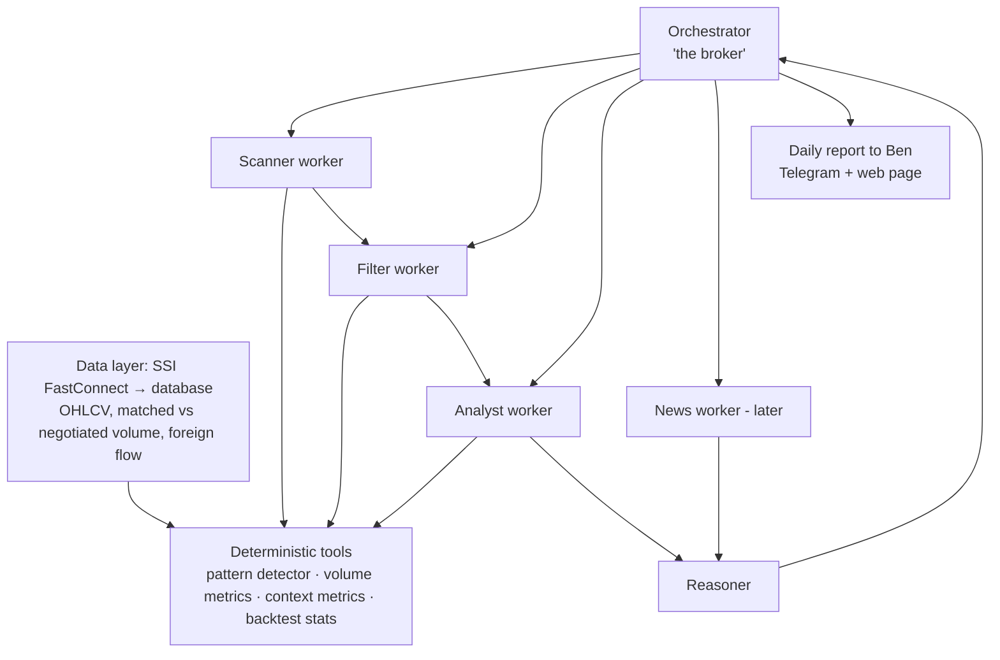

# VN Stock Pattern Researcher — Knowledge Document

2026-09-22 · @Someone

## 1. What this document is

This is the knowledge foundation for a **pattern-research tool for the Vietnamese stock market** (HOSE, HNX, UPCoM). It is written so that Ben can understand the whole idea *before* anything is built. No implementation happens until this document makes sense.

**The goal in one sentence:** every day, scan every Vietnamese stock code, study how its recent price and volume behaviour compares with what historically happened after similar behaviour, and propose **one stock** with the evidence behind it.

**Three framing decisions:**

- **Research, not prediction.** The tool does not claim to know the future. It says: *"This shape, with this volume, on this stock, was followed by a rise X% of the time in the past."* That is a statement about history, which can be checked.
- **Ben is the end user and the decision-maker.** The tool proposes; Ben reviews and decides. It is never an automatic buy button. (This also keeps it clear of Vietnamese investment-advisory licensing, since it is not advising third-party clients.)
- **"Good", not "correct".** Markets offer no certainty. A good recommendation is one with enough evidence to be worth considering, plus a clear statement of what would prove it wrong.

**Signal horizon:** short-term. The patterns of interest form over **3–5 trading days**, and the question is what happens over the **following few days**. Longer patterns (weekly, monthly) are useful as background context, not as the main signal.

**Where the knowledge comes from:** Ben's broker friend, who has studied Vietnamese price data from around 2010 onwards, plus the public body of technical-analysis literature. The friend's judgement is the real edge; this system is a way to write it down and test it honestly.

## 2. The core mechanism: how patterns become signals

A candlestick chart is a picture drawn from five numbers per day: **Open, High, Low, Close, Volume (OHLCV)**. Every pattern lives in those numbers. The system works in three layers.

### Layer 1 — Definition (the pattern is a rule)

Each pattern is written as plain arithmetic on OHLCV. Example, **bullish engulfing**:

1. Yesterday closed red (close < open).
2. Today closed green (close > open).
3. Today's body covers yesterday's body (today's open ≤ yesterday's close, and today's close ≥ yesterday's open).

Three comparisons. No image, no opinion. The same rule gives the same answer every time.

### Layer 2 — Detection (find every occurrence)

Run each rule across the full history of every stock code — roughly 1,500 codes over 10–15 years. Every day the rule is true, plant a flag. Result: a complete list of every time that pattern appeared, per stock.

### Layer 3 — Measurement (count what happened next)

This is the part that turns a shape into a signal. For each flag, look forward and record:

- Did the close rise or fall after **3 days? 5 days?**
- How far did it go at best (maximum gain) and at worst (maximum drawdown) in that window?
- Did it hit a target (e.g. +5%) before it hit a stop (e.g. −3%)?

Across hundreds or thousands of flags, this gives a real statistic, for example: *"On stock X, since 2012, bullish engulfing with above-average volume was followed by a higher close 5 days later in 58% of 140 cases; average gain +2.1%, average loss −1.4%."*

> **The pattern is the question. The history is the answer.** A shape on its own means nothing; a shape plus its measured track record is a signal.

### The comparison that matters: the base rate

58% sounds good, but only if it beats what happens on a *random* day. If stock X rises over 5 days on 55% of all days anyway (because it was in a long uptrend), the pattern only adds 3 points. Every pattern statistic must be compared with the stock's **base rate** over the same period. The edge is the difference, not the headline number.

## 3. Short-term pattern catalogue

These are the public, named patterns that match the 1–5 day horizon. Names are traditional (Japanese candlestick terms). **The traditional "bullish/bearish" label is a hypothesis, not a fact** — backtests have found some patterns move in the opposite direction to their name. Every one gets measured on Vietnamese data before it is trusted.

**Vocabulary first.** *Body* = distance between open and close. *Upper wick* = high minus the top of the body. *Lower wick* = bottom of the body minus low. *Range* = high minus low. Green = close above open; red = close below open.

### 3.1 Single-candle patterns

| Pattern | Rule in plain arithmetic | Traditional meaning | Needs context |
| --- | --- | --- | --- |
| Hammer | Lower wick ≥ 2× body; body in top third of range; small upper wick | Sellers pushed down, buyers pushed back → possible bottom | After a decline |
| Inverted hammer | Upper wick ≥ 2× body; body in bottom third | Early buying attempt | After a decline |
| Shooting star | Same shape as inverted hammer | Buyers rejected → possible top | After a rise |
| Hanging man | Same shape as hammer | Warning of weakness | After a rise |
| Doji | Body ≤ \~5–10% of range | Indecision | Meaning depends entirely on location |
| Marubozu (long body) | Body ≥ \~90% of range | Strong one-sided conviction | Volume matters |

Note that hammer and hanging man are the *same shape*. Only the trend before them differs. This is why context (section 5) is not optional.

### 3.2 Two-candle patterns

| Pattern | Rule | Traditional meaning |
| --- | --- | --- |
| Bullish engulfing | Red day, then green day whose body covers the red body | Reversal up |
| Bearish engulfing | Green day, then red day whose body covers it | Reversal down |
| Bullish harami | Long red day, then small body fully inside it | Selling is fading |
| Bearish harami | Long green day, then small body inside it | Buying is fading |
| Piercing line | Red day, then green day opening lower and closing above the midpoint of the red body | Reversal up |
| Dark cloud cover | Green day, then red day opening higher and closing below its midpoint | Reversal down |

Chinese-market research found harami patterns among the most accurate two-day patterns, and engulfing patterns useful only for very short forecasts (under 2 days).

### 3.3 Three-candle patterns

| Pattern | Rule | Traditional meaning |
| --- | --- | --- |
| Morning star | Long red day → small-body day → long green day closing well into the first day's body | Bottom reversal |
| Evening star | Mirror image at a top | Top reversal |
| Three white soldiers | Three green days, each closing higher, each opening inside the previous body | Strong buying |
| Three black crows | Mirror image | Strong selling |
| Three inside up / down | Harami followed by a confirming third day | Confirmed reversal |

Multi-candle patterns tend to test better than single candles because they already contain some confirmation.

### 3.4 Short consolidations (3–7 days) — likely closest to what the broker friend watches

These are not classic candlestick names, but they describe the "shape forming over 3–5 days" Ben described:

- **Tight range / squeeze:** several days where the range is much smaller than the stock's usual range. Energy is building; a breakout often follows. Rule: average range of last N days < X% of the 20-day average range.
- **Inside-day sequence:** each day's high–low sits inside the previous day's.
- **Flag / short pause:** a sharp rise, then 3–5 small days drifting sideways or slightly down on *falling* volume, then a breakout.
- **Higher lows:** each day's low is above the previous one while highs are flat — buyers are stepping in earlier each day.
- **Breakout day:** close above the highest high of the last N days, on strong volume.

### 3.5 Parameters are decisions, not facts

"Lower wick ≥ 2× body" could equally be 1.5× or 3×. Each threshold is a choice, and choosing the one that looks best on history is the most common way to fool yourself (section 8). The plan: fix sensible textbook values first, measure, and only then let the broker friend adjust them with reasons.

### 3.6 Real charts are layered: many patterns, many cases at once

The catalogue above lists patterns one by one, but a real chart never shows one clean pattern. On any given day, a stock's chart usually contains **several patterns at the same time**, some pointing up and some pointing down, and each named pattern comes in **several different cases**. The system has to reason about the whole picture, not a single shape.

**Five realities of a real chart:**

1. **Co-occurrence.** One day can be a hammer, a bullish harami, a volume spike and a touch of support — all at once. These overlap and reinforce each other; they are not four independent signals.
2. **Conflict.** Bullish and bearish evidence often appear together. Example: a bullish engulfing candle today, but the stock is below a falling 50-day average and running into resistance. The small pattern says up; the bigger structure says down.
3. **Many cases of the same pattern.** "Bullish engulfing" is not one thing. After a 3-day dip or a 3-week slide; engulfing barely or by 3×; on 0.8× or 3× normal volume; at support or in empty space — these are different cases with different outcomes, and each must be measured separately.
4. **Nesting across timeframes.** A 3-day daily setup sits inside a weekly consolidation, which sits inside a monthly trend. The same daily hammer means different things in a weekly uptrend vs a weekly downtrend.
5. **Sequence.** Order matters: tight range → breakout on volume → quiet pullback → hammer at the breakout level is a story. The same four events in a different order tell a different story.

**Worked example — one stock, one day (illustrative):**

| Layer | What fires today | Direction |
| --- | --- | --- |
| Single candle | Hammer | Bullish |
| Two-candle | Bullish harami | Bullish |
| Short structure (5 days) | Higher lows, range compressing | Bullish |
| Volume | RVOL 2.1×, mostly matched volume; 4 of last 6 days above average | Bullish (accumulation) |
| Trend (daily) | Below 50-day average, average still falling | Bearish |
| Weekly | Inside a 6-week sideways range, near its bottom | Neutral / supportive |
| Market regime | VN-Index below its 50-day average | Bearish |
| Sector | Sector flat | Neutral |

A pattern-only tool would shout "two bullish patterns!". An honest tool says: *strong bullish short-term evidence with real money flow, fighting a weak trend and a weak market.* Then it asks history: **what happened on past days that looked like this whole picture?**

**How the system handles this:**

- **Fingerprint every stock-day.** Instead of asking "did pattern X fire?", each day is described by *all* its flags and measurements together — every pattern that fired, trend position, distance to support/resistance, volume measures, weekly position, market regime, sector. That full description is the day's fingerprint.
- **Measure combinations, not just single patterns** — but only combinations with enough historical occurrences to be trustworthy. Combinations multiply fast, so this is exactly where overfitting (section 8) is most dangerous.
- **Find historical look-alikes (analogs).** For today's fingerprint, search all history for the most similar days — on the same stock first, then similar stocks — and look at what happened next. This is close to how an experienced broker thinks ("I have seen this setup before, and it usually…"). It stays explainable, because the system can show Ben the actual past look-alike dates and charts.
- **Keep bullish and bearish evidence side by side.** The report shows both columns and how history resolved similar conflicts, rather than hiding the bearish side.
- **Test layer priority, don't assume it.** A common rule of thumb is that the higher timeframe wins (a weekly downtrend overrides a daily bullish candle). That is a rule to *measure* on Vietnamese data, and to check against the broker friend's view.

**Questions to add for the broker friend:** When bullish and bearish signals appear together, which does he trust? Does he think in combinations ("hammer + volume + support") or does one element dominate? Which cases of a pattern does he treat as fake?

## 4. Money flow and volume — a signal in its own right

Ben's point, and an important correction to a pattern-only view: **a candle shape without volume behind it is just a drawing.** When heavy volume persists for 5–7 days, real capital is entering the company (accumulation). That is often more informative than the shape itself.

So volume is treated as a **first-class signal**, measured exactly like a pattern: define it as a rule, find every occurrence, count what happened next.

### 4.1 Volume measures to compute

| Measure | Plain definition | What it suggests |
| --- | --- | --- |
| Relative volume (RVOL) | Today's volume ÷ average of last 20 days | >1.5–2× = unusual interest |
| Sustained volume | Number of days in the last 5–7 with RVOL > 1.5 | Persistent inflow, not a one-day spike |
| Up-volume vs down-volume | Volume on green days vs red days over N days | Who is in control: buyers or sellers |
| Price–volume agreement | Price rising **and** volume rising | Healthy move |
| Divergence | Price rising while volume shrinks | Move running out of fuel |
| Traded value | Price × volume (in VND) | Real money, comparable across cheap and expensive stocks |
| Dry-up | Volume well below average during a pause | Sellers exhausted; often precedes a breakout |

### 4.2 Volume as a filter on patterns

Every pattern in section 3 is measured twice: once on its own, and once only when volume confirms it (e.g. the signal day has RVOL ≥ 1.5). Published tests consistently find the volume-confirmed version performs better. If that holds on Vietnamese data, only the confirmed version is kept.

### 4.3 Vietnam-specific: matched vs negotiated volume

Reported volume in Vietnam mixes two things:

- **Order-matched volume (khớp lệnh)** — the real auction between buyers and sellers.
- **Negotiated / block volume (thỏa thuận)** — pre-agreed deals between parties, often large and not representative of market demand.

A stock can show huge volume on a day when almost all of it was a single negotiated deal. That is **not** accumulation. The system must separate the two and compute money-flow measures on **matched volume only**. This is one of the places where a Vietnam-specific tool has a genuine advantage over generic chart software.

### 4.4 Foreign and proprietary flow (later layer)

Vietnamese exchanges publish net buying/selling by foreign investors, and many brokers track proprietary-desk (tự doanh) flow. Persistent foreign net buying is widely watched as a sign of "smart money". This is a candidate signal to test once the core is working — confirm with the broker friend how much weight he gives it.

## 5. Context — where the pattern appears matters as much as the pattern

The same hammer in the middle of a quiet sideways drift means little; at a support level after a sharp fall, on heavy volume, it can mean a lot. Context turns weak patterns into useful ones. Each context item below is also a rule that can be switched on or off and measured.

### 5.1 Trend before the pattern

- **Measure:** price vs its 20-day and 50-day moving average; slope of those averages; % change over the last 10–20 days.
- **Why:** reversal patterns need something to reverse. A "bottom" signal with no prior decline is not a bottom.

### 5.2 Support and resistance

- **Support:** a price zone where the stock has repeatedly stopped falling (previous lows). **Resistance:** where it has repeatedly stopped rising (previous highs).
- **Rule sketch:** is today's low within \~2% of a low that held at least twice in the last 60 days?
- **Why:** bullish patterns at support and breakouts through resistance tend to carry more meaning.

### 5.3 Market regime (the whole market, not just the stock)

- **Measure:** is the VN-Index above or below its 50-day average? Is market breadth (how many stocks rose today) strong or weak?
- **Why:** in Vietnam most stocks move together. A perfect bullish setup during a market-wide sell-off usually fails. The system should record the regime alongside every signal and report hit rates separately for good and bad market conditions.

### 5.4 Sector behaviour

Banks, real estate, securities firms and steel tend to move as groups. A signal on one bank when the whole banking sector is strengthening is more credible than one against its sector.

### 5.5 News — handled separately

Ben's observation: Vietnamese investors react fast and hard to news. A strong stock can be dumped on one bad headline. News **overrides patterns**, but it is hard to predict with. The design:

- News is **not** used to generate signals (at least initially).
- News is used as a **veto / warning**: if a recommended stock has fresh negative news, the report must say so clearly.
- Later layer: a news-reading agent that flags events (earnings, leadership changes, legal issues, rumours) — see section 9.

### 5.6 Vietnam market rules that change the maths

These are structural, and any honest backtest must include them:

| Rule | Effect on the research |
| --- | --- |
| **Daily price limits** (±7% HOSE, ±10% HNX, ±15% UPCoM) | A stock hitting the ceiling (trần) cannot be bought easily; a stock at the floor (sàn) cannot be sold. A backtest that assumes you can trade at the limit price is lying. |
| **Settlement (T+2)** | Shares bought today arrive in your account after about 2 trading days, so the earliest realistic sell is roughly day 3. A "1-day" pattern edge may be untradeable. 3–5 day horizons fit this rule — a point in favour of Ben's chosen timeframe. |
| **Long-only for retail** | Retail cannot easily short stocks, so bearish signals are useful mainly as "avoid" or "sell what you hold", not as trades. |
| **Fees and tax** | Broker fees plus 0.1% sale tax. Small average gains can disappear after costs. |
| **Liquidity** | Thin stocks may show great statistics that cannot be traded in real size. Set a minimum average traded value. |
| **Retail-dominated, herd behaviour** | Likely part of why patterns may work *better* here than in the US — and also why news shocks are violent. |

*(Price-limit and settlement details should be re-confirmed against current exchange rules before building.)*

## 6. What the research says about reliability

### 6.1 Ignore the marketing numbers

Many websites quote success rates like 95% for cup-and-handle or 89% for head-and-shoulders. These come from selective examples and loose definitions. **Anyone quoting 90%+ is selling something.** Serious backtesting guides explicitly warn to be sceptical of win rates above \~75%.

### 6.2 Academic findings — mixed, but with a useful pattern

| Study | Market | Finding |
| --- | --- | --- |
| Marshall, Young & Rose (2006) | US, Dow 30 stocks | 28 common candlestick patterns showed no real edge over a decade |
| Caginalp & Laurent (1998) | US, S&P 500 | Some three-day patterns had short-term predictive power |
| Lu & Shiu (2012) | Taiwan | Several bullish reversal patterns were profitable in this less efficient market |
| Chen, Bao & Zhou (2016) | China | Harami and homing pigeon most accurate; engulfing good only for <2-day forecasts |
| Tharavanij et al. (2017) | Thailand | Even with filtering, most patterns could not reliably predict direction |
| Ahlawat (chart patterns) | Cross-section | No chart pattern produced significant profits across stocks/indices |

**The useful reading:** patterns tend to fail in large, efficient, professional markets and sometimes work in smaller, retail-heavy, less efficient ones. Vietnam is much closer to Taiwan and China than to the US. That is a reason to *test* — not a reason to *believe*. Thailand, another emerging market, showed mostly nothing.

### 6.3 Consistent practical lessons

1. **Realistic hit rates are \~55–65%**, not 90%. That can still be profitable if average wins exceed average losses and costs are covered.
2. **Multi-candle patterns beat single candles.**
3. **Volume confirmation raises hit rates** in nearly every test.
4. **Context beats pattern.** A mediocre pattern with good filters beats a "perfect" pattern in isolation.
5. **Traditional direction labels can be wrong.** One practitioner backtest found a "bearish" engulfing behaving bullishly, repeatedly, and similar reversals for other patterns.
6. **Most patterns fire rarely.** On a single stock, a pattern may appear only a few dozen times in 15 years — too few to trust. This matters for per-stock measurement (section 7).

### 6.4 What this means for the project

The project's value is not in knowing the patterns — they are public. The value is in **measuring them honestly on Vietnamese data, per stock, with Vietnamese trading rules and costs**, and in encoding the broker friend's context judgement. Nobody offers that to a retail investor today.

## 7. The filtering funnel

Ben's idea: start with every code, drop weak patterns and weak stocks, keep narrowing until one stock survives with real evidence. This is the shape of the whole system. There are two phases: a **research phase** (done once, then refreshed periodically) and a **daily scan**.

### 7.1 Research phase — build the "pattern library"

1. **Measure every pattern on every stock** across history (section 2), with and without volume and context filters.
2. **Measure per stock, not only globally.** A large bank and a thin small-cap do not behave alike. Some stocks "obey" patterns; some are noise.
3. **Handle small samples honestly.** If a pattern fired only 12 times on one stock, that number is unreliable. Use three levels and fall back when data is thin: *this stock* → *this stock's group* (sector or liquidity tier) → *whole market*.
4. **Keep only what clearly beats the base rate**, with enough occurrences, and holds up in the validation tests of section 8.
5. **Result:** a table of "strong" pattern + context combinations, and a behaviour profile per stock ("this stock responds well to volume breakouts, ignores hammers").

### 7.2 Daily scan — find today's candidate

| Step | Filter | Rough count remaining |
| --- | --- | --- |
| 1 | All listed codes (HOSE, HNX, UPCoM) | \~1,500+ |
| 2 | Liquidity: minimum average matched traded value; not suspended or under warning | a few hundred |
| 3 | Market regime check — if the whole market is weak, raise the bar or recommend nothing | same |
| 4 | Did a **strong** pattern or money-flow signal fire today? | dozens |
| 5 | Does it have a good track record **on this stock** (or its group)? | \~5–15 |
| 6 | Context conditions met (trend, support, volume, sector) | a handful |
| 7 | Rank by evidence strength; check news for vetoes | **1 recommendation** (+ runners-up for reference) |

### 7.3 "No recommendation today" is a valid answer

If nothing passes, the system should say so. A tool that always produces a pick will eventually produce bad picks to fill the slot. The broker friend's discipline — reacting only to the right behaviour — includes waiting.

### 7.4 What a recommendation contains

- The stock and the signal that fired (pattern + volume + context).
- Its measured history: occurrences, hit rate vs base rate, average gain vs average loss, over which years.
- A risk-defined setup: a reference entry, a **stop level** (the price that says "this was wrong"), and a target zone.
- What would invalidate it: e.g. market regime turns, negative news, volume dries up.
- The runners-up and why they ranked lower.

### 7.5 Scaling the research — every stock since 2012, fully automated

Ben's requirement: **full history is a must**, not a minimum — the broker friend studied every stock from 2010. The research window is set at **2012 to now** (skipping the most distorted post-crisis years), across daily, weekly and monthly timeframes, for every code. That cannot be done by studying charts one by one. It has to be a machine that studies every stock the same way, automatically.

**The good news: for a computer, this is a small amount of data.**

| Item | Rough size |
| --- | --- |
| Trading days, 2012 → now | \~3,650 daily candles per stock (fewer for stocks listed later) |
| Stocks (HOSE + HNX + UPCoM) | \~1,600 today; fewer were listed in 2012 |
| Total daily candles | \~4.5–5.5 million rows (upper bound) |
| Fingerprint per stock-day (\~100 measures, section 3.6) | \~2 GB uncompressed; far less compressed |
| Weekly and monthly candles | Built from the daily data — no extra download |

That fits on a laptop. Detecting every pattern across every stock and every day takes seconds to minutes, not months. The months of work are in **designing the rules and validating them honestly** — not in the computing.

(Minute-level intraday data would be \~200× larger. It is not needed for a 3–5 day horizon.)

**How it is automated — build once, then update nightly:**

1. **Rules as a library, not as case-by-case work.** Each pattern, volume measure and context measure is written once as a rule. Adding a rule means it automatically runs on every stock and every day since 2012.
2. **Compute the full history in one batch.** Run every rule over all \~5 million stock-days and store the result: one fingerprint row per stock per day.
3. **Compute the statistics in one batch.** For each pattern and combination: occurrences, what happened next, hit rate vs base rate — per stock, per group, per market regime, per year.
4. **Build each stock's behaviour profile automatically.** This is the machine version of "intrinsic power":
   - How strongly it trends vs moves sideways
   - Typical daily range (volatility) and how it behaves after big moves
   - How closely it follows the VN-Index and its sector
   - How it reacts to volume spikes and sustained accumulation
   - Which patterns it respects and which it ignores
   - How fast it recovers after drops; liquidity profile over time
5. **Nightly update.** After the market closes, only the new day is added: new candles → new fingerprints → today's scan. That takes minutes.
6. **Periodic re-research.** Every few months, re-run the statistics to check whether edges still hold or are fading.

**Where human effort still goes:** writing and refining rules with the broker friend, reviewing the statistics, and questioning results that look too good. The machine does the repetition; people do the judgement.

**Data problems to solve before any of this can be trusted:**

- **History depth:** confirm how far back SSI's daily data goes and whether it covers delisted stocks. A second source may be needed.
- **Price adjustment:** Vietnamese companies frequently pay stock dividends and issue rights. These create fake price drops on the chart. All history must be adjusted for these, or patterns will fire on events that were never real moves.
- **Matched vs negotiated volume:** must be available separately for the full history (section 4.3).
- **Newer listings:** stocks listed after 2012 have less history, so they lean more on group-level statistics.
- **Market rule changes:** trading rules, price limits and exchange systems have changed over the years. Results are checked year by year so these shifts are visible.

**Extra checks for the early years (2012–2014):** price limits and trading rules then differed from today's, so backtests must apply the rules in force at each date; results from those years are reported separately rather than blended silently into the total.

#### What SSI FastConnect actually provides for history (from the published API docs)

| Endpoint | Useful fields | Notes |
| --- | --- | --- |
| **DailyStockPrice** — the main history source | Open, high, low, close, average price, **adjusted close**, reference/ceiling/floor price, **matched volume and value**, **negotiated (deal) volume and value**, **foreign buy/sell volume and value**, foreign room, total traded incl. odd lots | Symbol is optional, so one request can return the whole market for a date range. Paging up to 10 pages × 1,000 rows. |
| DailyOhlc | OHLC + matched volume/value only | Older spec limits each request to a 30-day range. Simpler, but lacks deal and foreign data. |
| DailyIndex | VN-Index etc.: value, advances/declines, ceiling/floor counts, matched vs deal volume | Gives market regime and breadth (section 5.3). |
| SecuritiesDetails | Listed shares, first/last trading date | Helps with listing dates; delisted coverage unconfirmed. |

**Good news:** DailyStockPrice contains almost everything this research needs — including the matched vs negotiated split (section 4.3) and foreign flow (section 4.4). It also gives an adjusted close; the ratio *adjusted close ÷ close* can be applied to open/high/low to adjust the whole candle for dividends and rights.

**Not confirmed:** the docs do not state how far back history goes, whether delisted stocks are included, or the rate limits. These can only be answered by testing with real credentials. The download itself is small — roughly 3,650 trading days, a few requests per day for the whole market — so even at a slow, polite pace it is an overnight job, not weeks.

**Backup if SSI history is short:** other Vietnamese data providers and open-source libraries that aggregate broker data exist; they would need the same checks (depth, adjustment, matched vs deal split) before use.

## 8. Validation discipline — how not to fool ourselves

This is the section that decides whether the project is real. With 1,500 stocks × dozens of patterns × several filters × several holding periods, there are **tens of thousands of combinations**. By pure chance, hundreds will look excellent on history. Most of those are luck and will fail going forward. The rules below exist to separate real edges from luck.

### 8.1 The traps

| Trap | What it looks like | Defence |
| --- | --- | --- |
| **Overfitting** | Tuning thresholds until history looks great | Fix parameters before testing; limit how many variations are tried; record every variation tried |
| **Multiple testing** | Testing 10,000 combinations and celebrating the top 50 | Demand stronger evidence when more combinations were tested; confirm on unseen data |
| **Look-ahead bias** | Using information not available on the signal day (e.g. today's close to decide a trade at today's open) | Signal at day *t* close → earliest entry at day *t+1* |
| **Survivorship bias** | Testing only stocks listed today, ignoring delisted ones that collapsed | Include delisted stocks in history where data exists |
| **Ignoring costs and rules** | Gains that vanish after fees, tax, T+2 and price limits | Model all of them (section 5.6) |
| **Small samples** | 80% hit rate from 10 occurrences | Minimum occurrence count; fall back to group level |
| **Regime change** | Worked 2012–2017, stopped working after | Check results year by year, not just in total |

### 8.2 The testing sequence

1. **Split history.** For example: 2012–2019 to discover, 2020–2023 to validate, 2024–now held back untouched.
2. **Discover** on the first slice only.
3. **Validate** on the second slice. Anything that collapses is discarded, no matter how good it looked.
4. **Walk-forward:** repeat by rolling the window forward year by year — does the edge persist?
5. **Final check** on the untouched slice, once. If it is used to tune anything, it stops being untouched.
6. **Paper-trade forward** for weeks to months: the system makes daily picks, nothing is bought, results are logged.
7. Only then consider small real positions.

### 8.3 Metrics to report (not just win rate)

- **Hit rate vs base rate** — the edge.
- **Average win vs average loss** — a 45% hit rate can be profitable, a 65% one can lose money.
- **Expectancy** — average result per signal after costs.
- **Maximum drawdown** — the worst losing stretch; can Ben tolerate it?
- **Number of occurrences** — how much evidence stands behind the number.
- **Stability by year and by market regime.**

## 9. Multi-agent architecture (concept only — not for implementation yet)

Ben's vision: an **orchestrator** acting as the final "recommending broker", supported by **worker agents** that research, analyse and filter, and a **reasoner** that combines everything and explains the choice with evidence.

The key design principle: **agents coordinate and explain; deterministic code computes.** Every number an agent uses must come from a tool that calculated it, never from the agent's own estimate. Otherwise agents end up arguing about numbers instead of computing them.

### 9.1 Roles

| Role | Job | Mostly code or mostly LLM? |
| --- | --- | --- |
| **Scanner** | Runs all pattern and money-flow rules on today's data for every code; lists what fired | Code (no LLM needed) |
| **Filter** | Applies liquidity, regime, and "strong pattern on this stock" filters; cuts to a shortlist | Code |
| **Analyst** | For each shortlisted stock, pulls its historical statistics, context and sector picture | Code gathers; LLM may summarise |
| **News worker** (later) | Reads recent news for shortlisted stocks; flags vetoes | LLM |
| **Reasoner** | Weighs the evidence, compares candidates, writes the case for the pick and the case against it | LLM, using only tool-provided numbers |
| **Orchestrator** | Runs the daily sequence, decides "pick" or "nothing today", sends the report | Simple control logic + LLM for the final write-up |

### 9.2 Honest note on agents

Most of the pipeline is a fixed sequence (scan → filter → analyse → reason), so it could equally be written as ordinary code with one LLM step at the end. The agent framing becomes valuable when steps need judgement — reading news, deciding when evidence conflicts, answering Ben's follow-up questions ("why not stock Y?"). A sensible path: build the deterministic pipeline first, then add agents where judgement is genuinely needed.

### 9.3 Guardrails for the reasoner

- Must cite the numbers it used (occurrences, hit rate, base rate).
- Must always include the case **against** the pick and the stop level.
- Must be allowed — and encouraged — to say "nothing strong today".
- Never invents statistics; if a number is missing, it says so.

## 10. Code vs LLM — who does what

### 10.1 Why not a vision model?

A natural first thought is to show chart images to a vision model and ask it to recognise patterns. This goes backwards: the chart is *drawn from* OHLCV numbers, so the image is a blurrier copy of data we already have exactly. Arithmetic on the numbers is exact, fast across 1,500 codes, costs nothing, and gives the same answer every time. A vision model is slower, costs money per image, and can misread or invent shapes.

### 10.2 Why no model training?

Training a model on price data (machine learning) is possible but risky here: price data is mostly noise, and ML models are very good at memorising noise that looks like a pattern. They also cannot explain themselves, so the broker friend could not check or argue with them. **Rules first, measured honestly.** ML can be reconsidered later as a way to *rank* rule-based signals, never as an unexplainable black box.

### 10.3 The split

| Job | Done by | Why |
| --- | --- | --- |
| Store and clean data | Code + database | Exactness |
| Detect patterns | Code (rules on OHLCV) | Exact, repeatable, cheap |
| Compute volume / context metrics | Code | Exact |
| Measure historical hit rates | Code (backtest) | Needs statistics, not language |
| Filter and rank | Code, with rules the friend approves | Transparent |
| Read news | LLM | Language understanding |
| Weigh conflicting evidence, write the reasoning | LLM | Judgement and explanation |
| Answer Ben's questions about a pick | LLM | Conversation |

**In one line:** code finds the patterns and counts what happened after them; the LLM reads those counts and explains the case in plain language. Neither does the other's job.

## 11. Working with the broker friend, open questions, next steps

### 11.1 Knowledge elicitation — the hardest part

Much of what an experienced broker knows is intuition he cannot fully put into words. The way to extract it is iterative:

1. Ask him to show **real past examples** on charts: "this was a good setup", "this looked good but was a trap".
2. Turn each explanation into a draft rule.
3. Run the rule on history and show him every match. He says "yes", "no — not in that case", and explains why.
4. Refine the rule. Repeat.
5. Measure the refined rule's hit rate. Sometimes his intuition will be confirmed; sometimes the data will disagree — both are valuable.

### 11.2 Questions to ask him

- Which 5–10 setups does he trust most? Can he show 3 winning and 3 failing examples of each?
- What does "wrong behaviour" look like — what makes him react fast?
- How does he read volume: which days, what multiple of normal, matched only?
- How much weight does he give foreign flow, proprietary-desk flow, sector moves, the VN-Index?
- How long does he usually hold, and where does he put his stop?
- Which kinds of stocks does he avoid entirely?
- How does he handle news — which news types override a good chart?
- What pain points do his clients have? (Still pending from earlier sessions.)

### 11.3 Open questions for Ben

- Exact holding period to optimise for: 3 days, 5 days, or "until target or stop"?
- Minimum liquidity: which stocks are too small to consider?
- Risk tolerance: what size of losing streak is acceptable during paper trading?
- Is "no pick today" acceptable on most days, or is a daily pick expected?

### 11.4 Next steps (research first, building later)

| # | Step | Owner |
| --- | --- | --- |
| 1 | Read this document; mark anything unclear | Ben |
| 2 | Register with SSI in person to get FastConnect credentials | Ben |
| 3 | First elicitation session with the broker friend using 11.2 | Ben (Claude can prepare the session sheet) |
| 4 | Decide how much history is available and its quality (SSI daily OHLC depth, delisted stocks, matched vs negotiated split) | Ben + Claude |
| 5 | Write the first 10–15 pattern rules precisely, with fixed parameters | Claude, reviewed by the friend |
| 6 | Only then: build data ingestion and a backtest to measure them | Later |

### 11.5 Relationship to the earlier platform brief

The earlier v0.1 brief covered the live data pipeline (SSI streaming, Redis, TimescaleDB, hosting at \~$6/month). That remains the data foundation. Two updates apply: the message broker is removed (go direct, with Redis pub/sub as a seam), and the product is now this pattern researcher rather than a dashboard. For pattern research, **daily end-of-day data is enough to start** — the real-time streaming layer can come later.
